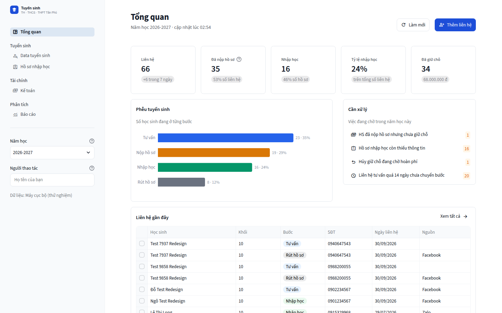
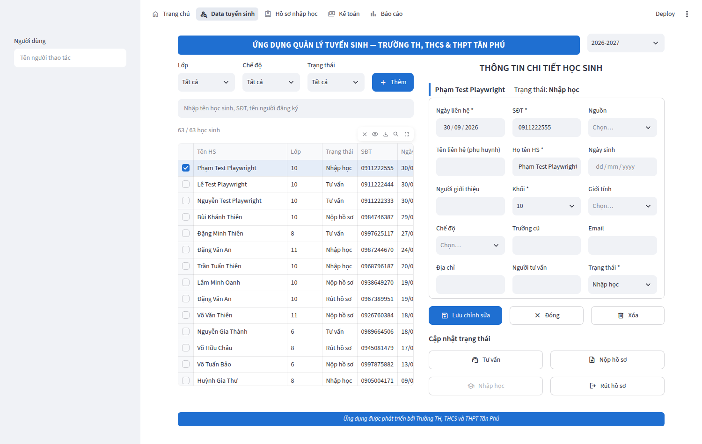
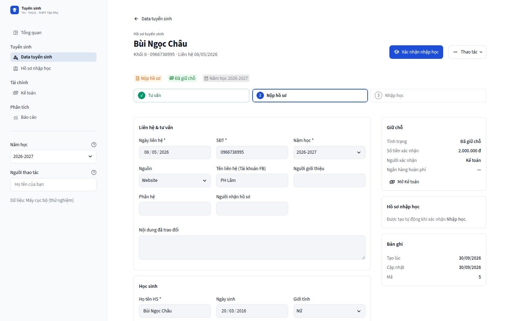
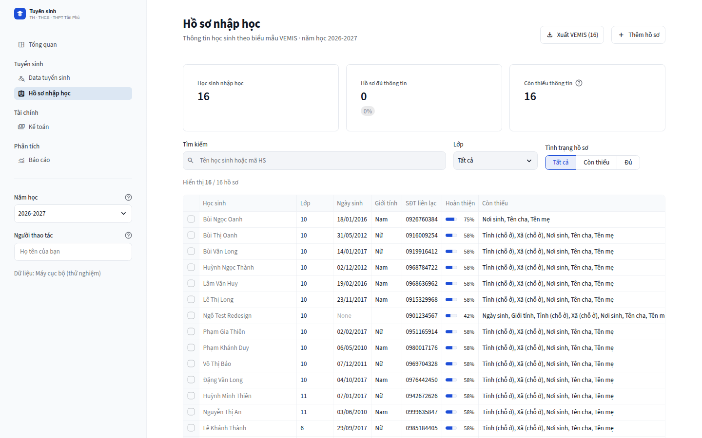

# Ứng dụng Quản lý Tuyển sinh — Trường TH, THCS & THPT Tân Phú

Phiên bản Python (Streamlit) thay cho app Power Apps. Dữ liệu vẫn lưu trên **SharePoint List**
(site `eduttc.sharepoint.com/sites/tuyensinh2`), ghi/đọc qua **1 flow Power Automate Premium** —
xem [docs/power_automate.md](docs/power_automate.md).

| Tổng quan | Data tuyển sinh |
|---|---|
|  |  |
| **Hồ sơ học sinh** | **Hồ sơ nhập học** |
|  |  |

Thiết kế giao diện: [docs/ux_redesign.md](docs/ux_redesign.md).

## Chức năng

| Mục | Nội dung |
|---|---|
| **Tổng quan** | Chỉ số chính, phễu tuyển sinh, danh sách *Cần xử lý* (chưa giữ chỗ, hồ sơ thiếu, chờ hoàn phí, tư vấn tồn đọng), liên hệ gần đây |
| **Data tuyển sinh** | Form nhập đúng các cột của list *Data tuyển sinh* hiện có (Nam hoc, Ngày liên hệ, SĐT, Nguồn, Tài khoản FB, Người giới thiệu, Họ tên HS, Khối, Giới tính, Chế độ, Trường cũ, điểm Toán/Văn/Anh/TV 1–2, Hạnh kiểm 1–2, …). Danh sách lọc Lớp / Chế độ / Bước, tìm theo tên, SĐT, người đăng ký. Nút **Bước**: Tư vấn → Nộp hồ sơ → Nhập học / Rút hồ sơ (lý do rút ghi vào "Nội dung đã trao đổi"). Cảnh báo trùng tên + SĐT |
| **Hồ sơ nhập học** | Khi bấm **Nhập học**, hồ sơ được tạo tự động từ Data tuyển sinh (năm học, họ tên, ngày sinh, giới tính, lớp, chế độ, SĐT). Bổ sung đủ 54 cột theo biểu mẫu **Danh sách học sinh (VEMIS)**, chọn Tỉnh → Xã/Phường theo danh mục mới (34 tỉnh, 3.321 xã). Cột "Thiếu" cho biết HS còn thiếu thông tin quan trọng. **Xuất Excel đúng biểu mẫu VEMIS** theo lớp |
| **Kế toán** | Xác nhận giữ chỗ trên các cột có sẵn (*Tình trạng, Số tiền xác nhận, Người xác nhận*), theo dõi **hoàn phí** khi hủy giữ chỗ (*Tên chủ tài khoản, Ngân hàng, Số tài khoản*), **tổng hợp giữ chỗ** theo khối, xuất Excel |
| **Báo cáo** | Thống kê khối × trạng thái, tỷ lệ nhập học, nguồn tuyển sinh, liên hệ theo tuần, chế độ nội trú/bán trú; tải báo cáo Excel |

Chọn **năm học** ở thanh bên — mọi trang đều lọc theo năm học. Giao diện hỗ trợ chế độ sáng/tối và điện thoại.

## Cấu trúc dữ liệu (SharePoint List)

| List | Nội dung | Định nghĩa |
|---|---|---|
| **Data tuyển sinh** (có sẵn, GUID `d0608833-…`) | HS liên hệ / tư vấn / nộp hồ sơ / giữ chỗ. App khớp cột theo **tên hiển thị** | `TUYEN_SINH` trong [`tuyensinh/schema.py`](tuyensinh/schema.py) |
| **Data_NhapHoc** (app tạo) | HS đã xác nhận nhập học — đủ 54 cột biểu mẫu VEMIS + *Nam hoc*, liên kết qua `TuyenSinhID` | `NHAP_HOC` |

Cả hai list đều có cột **Nam hoc**; mọi trang lọc theo năm học chọn ở góc trên.
## Địa giới hành chính & danh mục trường

- **Tỉnh → Phường/Xã** theo địa giới mới nhất (34 tỉnh/thành, 3.321 phường/xã; bản v5.2.0 theo
  NQ 388/NQ-UBTVQH16, hiệu lực 20/09/2026 — gồm việc Đồng Nai, Quảng Ninh, Bắc Ninh thành
  thành phố trực thuộc TW). Chọn tỉnh trước, danh sách phường/xã tự đổi theo; đổi tỉnh thì phường/xã
  cũ tự xóa. Tên tỉnh cũ trong dữ liệu (vd "Tỉnh Đồng Nai") được tự quy đổi sang tên mới.
  Cập nhật khi có nghị quyết mới: `python scripts/update_danh_muc.py`
- **Trường cũ**: chọn Tỉnh → Phường/Xã → gợi ý trường thuộc phường/xã đó (trường đúng cấp với
  khối đăng ký lên đầu, vd khối 10 → THCS). Danh mục `tuyensinh/data/truong_hoc.csv` (~8.600 trường
  mầm non → THPT toàn quốc) được **tự động lấy từ OpenStreetMap** và gán Phường/Xã theo tọa độ trong
  ranh giới sau sáp nhập — GitHub Actions *Cập nhật danh mục trường học* chạy hằng tháng, hoặc bấm
  *Run workflow* để chạy ngay. Kèm các trường đã nhập trước đây; vẫn gõ được tên trường mới.
  Nạp danh mục trường (xuất từ CSDL ngành / Sở GD&ĐT, cột *Tỉnh/Thành phố, Phường/Xã, Tên trường,
  Cấp học*): `python scripts/import_truong_hoc.py ds_truong.xlsx`
- Các danh mục khác (dân tộc, tôn giáo, quốc tịch, diện chính sách, khuyết tật, nội trú/bán trú)
  lấy từ file mẫu VEMIS. Tất cả lưu ở `tuyensinh/data/`.

## Chạy thử trên máy (không cần SharePoint)

```bash
python -m venv .venv
.venv\Scripts\activate          # Windows   (macOS/Linux: source .venv/bin/activate)
pip install -r requirements.txt
python scripts/seed_demo.py     # tạo 60 HS mẫu (tuỳ chọn)
streamlit run app.py            # mở http://localhost:8501
```

Mặc định `BACKEND=local` lưu vào file `data_local.sqlite3`.

## Kết nối SharePoint

**Cách khuyên dùng — Power Automate Premium** (không cần quyền quản trị Entra ID):
làm theo [docs/power_automate.md](docs/power_automate.md), rồi

```bash
python scripts/inspect_sharepoint.py          # kiểm tra kết nối, xem cột nào đã khớp
python scripts/setup_sharepoint.py            # tạo list Data_NhapHoc + cột còn thiếu
```

**Cách khác — Microsoft Graph**: đăng ký App trên Entra ID (quyền Application
`Sites.ReadWrite.All` hoặc `Sites.Selected`), đặt `BACKEND = "sharepoint"` và điền mục
`[sharepoint]` trong `secrets.toml`.

### Chuyển sang list mới (chuẩn hóa dữ liệu cũ)

1. Xuất list cũ ra Excel (*Export to Excel*), rồi chuẩn hóa:
   ```bash
   python scripts/chuan_hoa_du_lieu_cu.py data_tuyensinh.xlsx -o Data_TuyenSinh_chuan_hoa.xlsx
   ```
   - Tên cột → tên nội bộ không dấu (`HoTenHS`, `TruongCu_PhuongXa`…); sheet *Cau_truc_cot* ghi tên
     hiển thị, kiểu cột, lựa chọn và cột cũ tương ứng.
   - Tỉnh cũ (63) → tỉnh/thành mới (34); quận/huyện cũ được nhận diện và giữ ở `TruongCu_DiaChiCu`;
     Trường cũ đối chiếu danh mục trường trong đúng tỉnh, quận/huyện cũ → tên chuẩn + Phường/Xã mới.
     Trường không có trong danh mục được viết đầy đủ ("THCS TT…" → "Trường Trung học cơ sở Thị trấn…").
   - Khối "10-IEP" → `Khoi`=10 + `PhanHe`=IEP; thêm cột `GiuCho` (tách khỏi Tình trạng tư vấn);
     chuẩn hóa Nguồn, Ngân hàng, SĐT, họ tên.
   - Sheet *Bao_cao_chuan_hoa*: đối chiếu gốc ↔ chuẩn hóa từng dòng, lọc "chưa khớp" để rà tay.
2. Tạo list **Data_TuyenSinh** mới — một trong hai cách (chi tiết ở sheet *Huong_dan*):
   - `python scripts/setup_sharepoint.py` (đúng kiểu cột, tên hiển thị tiếng Việt), rồi
     `python scripts/import_excel.py tuyensinh Data_TuyenSinh_chuan_hoa.xlsx --nam-hoc 2026-2027 --giu-nguyen`
   - hoặc SharePoint → *Mới → Danh sách → Từ Excel* → chọn bảng `Data_TuyenSinh`.
3. Đặt `SP_LIST_Data_TuyenSinh = "Data_TuyenSinh"` trong `secrets.toml`.

`--giu-nguyen` ghi cả những dòng cũ thiếu trường bắt buộc (vd chưa có ngày liên hệ) để không mất dữ liệu.

### Đăng nhập bằng tài khoản Microsoft 365 (tuỳ chọn)

Thêm mục `[auth]` vào `secrets.toml` (mẫu có trong `secrets.toml.example`) — app sẽ yêu cầu đăng nhập
và tự ghi tên người thao tác (người nhận hồ sơ, người xác nhận). Redirect URI của App registration
phải là `https://<địa-chỉ-app>/oauth2callback`.

## Triển khai

- **Máy chủ trong trường / Windows**: `streamlit run app.py --server.port 80`
  (có thể chạy như Windows Service bằng NSSM).
- **Streamlit Community Cloud**: đẩy repo lên GitHub → <https://share.streamlit.io> → dán nội dung
  `secrets.toml` vào mục *Secrets*.
- Docker / Azure App Service: lệnh khởi động `streamlit run app.py --server.port $PORT --server.address 0.0.0.0`.

## Cấu trúc mã nguồn

```
app.py                     # điểm vào: sidebar (menu nhóm, năm học), đăng nhập, bắt lỗi chung
views/                     # các trang: trang_chu, data_tuyen_sinh, ho_so_nhap_hoc, ke_toan, bao_cao
tuyensinh/ui.py            # hệ thống thiết kế: token màu, component dùng chung
static/                    # logo, icon
tuyensinh/schema.py        # định nghĩa list & cột (thêm/sửa trường tại đây)
tuyensinh/services.py      # nghiệp vụ: lưu, chuyển bước, tạo hồ sơ nhập học, giữ chỗ
tuyensinh/export_vemis.py  # xuất Excel theo biểu mẫu VEMIS
tuyensinh/storage/         # powerautomate.py, sharepoint.py (Graph), local.py (SQLite), convert.py (khớp cột)
scripts/                   # setup_sharepoint, inspect_sharepoint, import_excel, seed_demo
tests/                     # pytest
```

Chạy kiểm thử: `pip install pytest && pytest`.
